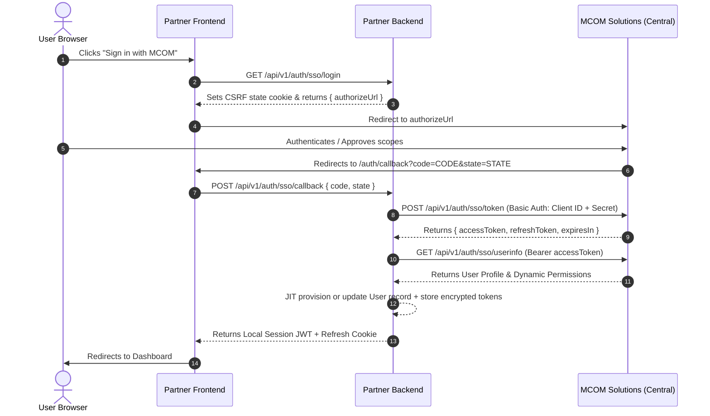

# MCOM Ecosystem Partner Service Integration Specification
**A Comprehensive, Foolproof Engineering Guide for All MCOM Services (Mall, VCards, Loyalty, Spin, GBS, etc.)**

---

## 1. Executive Overview & Core Architecture

The **MCOM Ecosystem** follows a hub-and-spoke architecture:
- **MCOM Solutions (Central):** The authoritative hub for Identity (SSO), Billing (Stripe / PayPal / Centralized Wallet), Ecosystem Memberships, and App Governance.
- **Partner Services (MCOM Mall, MCOM VCards, MCOM Loyalty, MCOM Spin, etc.):** Independent client platforms offering specialized features, product listings, digital business cards, rewards, or games.

```
                                  ┌────────────────────────────────────────────────────────┐
                                  │                  MCOM SOLUTIONS (CENTRAL)              │
                                  │                                                        │
                                  │   ┌──────────────┐ ┌───────────────┐ ┌───────────────┐ │
                                  │   │  OAuth2 SSO  │ │  Payment Hub  │ │  MCOM Console │ │
                                  │   │  & Identity  │ │ Stripe/PayPal │ │  Plan Manager │ │
                                  │   └───────┬──────┘ └───────┬───────┘ └───────┬───────┘ │
                                  └───────────┼────────────────┼─────────────────┼─────────┘
                                              │                │                 │
                         1. OAuth SSO / JIT   │    3. In-App   │    2. API Key   │ 4. HMAC Webhooks
                         Direct Handshake JWT │    Checkout    │    Plans CRUD   │ & Data-Sharing
                                              │    Proxies     │    Contract     │ Permissions
                                              ▼                ▼                 ▼
                                  ┌────────────────────────────────────────────────────────┐
                                  │              PARTNER SERVICE (e.g. MCOM VCards)        │
                                  │                                                        │
                                  │  ┌───────────────────────┐  ┌───────────────────────┐  │
                                  │  │   Partner Frontend    │  │    Partner Backend    │  │
                                  │  │  - Stripe Elements UI │  │  - /system/plans      │  │
                                  │  │  - Plans Selector UI  │  │  - /mcom/packages/*   │  │
                                  │  │  - SSO Redirect UI    │  │  - /mcom/webhook      │  │
                                  │  └───────────────────────┘  └───────────────────────┘  │
                                  └────────────────────────────────────────────────────────┘
```

### The 4 Core Integration Pillars
1. **Identity & Single Sign-On (SSO):** Users log in once via MCOM Central; partner services Just-In-Time (JIT) provision local accounts.
2. **Plans CRUD API:** Partner services expose standardized `/api/v1/system/plans` endpoints so MCOM Solutions Console Admins can configure, price, and adjust quotas without deploying partner code.
3. **In-App Plan Purchases (Proxied Billing):** Users purchase plans directly within the partner app's UI; the partner backend proxies payment orchestration to MCOM Solutions.
4. **Entitlements, Permissions & Webhooks:** Real-time data sharing and HMAC-signed lifecycle webhooks (`package.created`, `package.renewed`, `package.expired`) keep user quotas and feature access synced.

---

## 2. Configuration & Environment Variables Matrix

Every partner service must define the following variables in their `.env` file:

```bash
# ── MCOM CENTRAL CONNECTIVITY ──────────────────────────────────────────────────
# Central Base URL (Local: http://localhost:3010 | Staging: https://staging.auth.mcomsolutions.com | Prod: https://auth.mcomsolutions.com)
MCOM_SOLUTIONS_URL=https://auth.mcomsolutions.com

# Your Platform Identifier (Registered in MCOM Console, e.g., 'vcard', 'mall', 'loyalty')
MCOM_PLATFORM_SLUG=vcard

# ── CREDENTIALS (Generated in MCOM Console) ───────────────────────────────────
# 1. OAuth2 Client Credentials (Used for SSO Code Exchange)
MCOM_CLIENT_ID=mcom-vcard
MCOM_CLIENT_SECRET=sec_oauth_client_secret_here

# 2. Inbound System API Key (Used to authorize MCOM Solutions when it calls your /system/plans)
MCOM_SOLUTION_API_KEY=key_shared_system_api_key_here

# 3. Server-to-Server HMAC Secret (Used to sign your requests to MCOM Data-Sharing API)
MCOM_HMAC_SECRET=sec_hmac_data_sharing_secret_here

# 4. Inbound Webhook Secret (Used to verify signatures of webhooks sent by MCOM Solutions)
MCOM_WEBHOOK_SECRET=sec_webhook_signing_secret_here

# 5. Shared JWT SSO Secret (Used to verify direct dashboard redirects: /sso-login?token=...)
SSO_SECRET=sec_shared_sso_jwt_secret_here

# ── REDIRECT & WEB URLS ────────────────────────────────────────────────────────
MCOM_REDIRECT_URI=https://vcard.mcomsolutions.com/auth/callback
WEB_PUBLIC_URL=https://vcard.mcomsolutions.com
```

---

## 3. Pillar 1: Identity & SSO Authentication

Partner services support two entry points for authentication:
1. **OAuth 2.0 Authorization Code Flow** (Initiated from Partner login page).
2. **Direct Dashboard Handshake** (User clicks the partner app card in MCOM Central Dashboard).

### 3.1 Local User Database Requirements
Partner databases should store the following fields on their `User` model:
```typescript
interface PartnerUserModel {
  id: string;                      // Local primary key (UUID)
  email: string;                   // User email (Unique)
  firstName?: string;
  lastName?: string;
  role: 'BUSINESS' | 'CUSTOMER';
  
  // MCOM Central Linking Fields
  mcomUserId?: string;             // Central User UUID (sub)
  mcomAccessToken?: string;        // Encrypted Central OAuth access token
  mcomRefreshToken?: string;       // Encrypted Central OAuth refresh token
  mcomTokenExpiresAt?: Date;
  
  // Cached Entitlements
  membershipLevel?: string;        // Bronze, Silver, Gold, Platinum
  membershipTier?: string;         // Free, Normal, Pro, Pro+
  membershipStatus?: string;       // active, inactive, trial
}
```

### 3.2 OAuth 2.0 Authorization Code Flow



#### Step 1: Start SSO (Generate State & Authorize URL)
```typescript
// Partner Backend: GET /api/v1/auth/sso/login
export function getAuthorizeUrl(state: string, config: ConfigService): string {
  const params = new URLSearchParams({
    client_id: config.get('MCOM_CLIENT_ID'),
    redirect_uri: config.get('MCOM_REDIRECT_URI'),
    scope: 'profile email business membership packages',
    state,
  });
  return `${config.get('MCOM_SOLUTIONS_URL')}/api/v1/auth/sso/authorize?${params.toString()}`;
}
```

#### Step 2: Code Exchange & JIT User Provisioning
```typescript
// Partner Backend: POST /api/v1/auth/sso/callback
export async function handleSsoCallback(code: string, clientId: string, clientSecret: string, redirectUri: string, baseUrl: string) {
  // 1. Exchange Code for Central Access Token
  const basicAuth = Buffer.from(`${clientId}:${clientSecret}`).toString('base64');
  const tokenRes = await axios.post(`${baseUrl}/api/v1/auth/sso/token`, {
    code,
    client_id: clientId,
    redirect_uri: redirectUri
  }, {
    headers: { Authorization: `Basic ${basicAuth}` }
  });

  const { accessToken, refreshToken, expiresIn } = tokenRes.data;

  // 2. Fetch User Profile
  const userRes = await axios.get(`${baseUrl}/api/v1/auth/sso/userinfo`, {
    headers: { Authorization: `Bearer ${accessToken}` }
  });
  const mcomUser = userRes.data; // { sub, email, firstName, lastName, role, businessId, ... }

  // 3. JIT Provision or Update Local User
  let localUser = await db.user.findOne({ where: { email: mcomUser.email } });
  if (!localUser) {
    localUser = await db.user.create({
      data: {
        email: mcomUser.email,
        firstName: mcomUser.firstName || '',
        lastName: mcomUser.lastName || '',
        role: mcomUser.role === 'BUSINESS' ? 'BUSINESS' : 'CUSTOMER',
        mcomUserId: mcomUser.sub,
        mcomAccessToken: encrypt(accessToken),
        mcomRefreshToken: encrypt(refreshToken),
        membershipLevel: mcomUser.membershipLevel,
        membershipStatus: mcomUser.membershipStatus,
      }
    });
  } else {
    await db.user.update({
      where: { id: localUser.id },
      data: {
        mcomUserId: mcomUser.sub,
        mcomAccessToken: encrypt(accessToken),
        mcomRefreshToken: encrypt(refreshToken),
        membershipLevel: mcomUser.membershipLevel,
        membershipStatus: mcomUser.membershipStatus,
      }
    });
  }

  return localUser;
}
```

### 3.3 Direct Dashboard Handshake (Shared JWT)
When a logged-in user in MCOM Solutions clicks the app card for your service:
1. MCOM Central signs a short-lived (60s) JWT containing the user's identity.
2. The user is redirected to `https://your-service.com/sso-login?token=<JWT>`.
3. Your backend validates the token using `process.env.SSO_SECRET` and creates the local session.

```typescript
// Partner Backend: GET /api/v1/auth/sso-login?token=...
export async function handleDirectHandshake(token: string, ssoSecret: string) {
  const decoded = jwt.verify(token, ssoSecret, { issuer: 'mcom-central' }) as {
    userId: string;
    email: string;
    firstName: string;
    lastName: string;
    role: string;
  };

  let user = await db.user.findUnique({ where: { email: decoded.email } });
  if (!user) {
    user = await db.user.create({
      data: {
        email: decoded.email,
        firstName: decoded.firstName,
        lastName: decoded.lastName,
        role: decoded.role === 'business' ? 'BUSINESS' : 'CUSTOMER',
        mcomUserId: decoded.userId,
      }
    });
  }
  return user;
}
```

---

## 4. Pillar 2: Plans CRUD API (System Connector)

MCOM Solutions Console allows administrators to create, edit, price, and delete subscription plans for your platform. **Your backend must expose these 5 CRUD endpoints.**

### 4.1 System API Authentication
MCOM Solutions sends the pre-shared secret in the `x-mcom-solution-api-key` header on every request.
```
x-mcom-solution-api-key: your-configured-mcom-solution-api-key
```
If the header is missing or does not match `process.env.MCOM_SOLUTION_API_KEY`, return `401 Unauthorized`.

### 4.2 API Contract Endpoints

| Method | Endpoint | Description |
|---|---|---|
| `GET` | `/api/v1/system/plans` | List all active and inactive plans |
| `GET` | `/api/v1/system/plans/:id` | Get details for a single plan by ID |
| `POST` | `/api/v1/system/plans` | Create a new plan |
| `PATCH` | `/api/v1/system/plans/:id` | Update pricing, quotas, or metadata |
| `DELETE` | `/api/v1/system/plans/:id` | Archive or soft-delete a plan |
| `GET` | `/api/v1/system/plans/schema` | *(Optional)* Return quotas & feature flags schema |
| `GET` | `/api/v1/system/seasons` | *(Optional)* Return list of active seasons |

### 4.3 Data Transfer Objects (DTOs)

#### Plan Object Schema
```typescript
interface PlanDto {
  id: string;                      // Unique Plan ID (UUID)
  name: string;                    // e.g. "Pro Business", "Starter"
  description?: string;
  monthlyPrice: number;            // GBP price (e.g. 29.99)
  quarterlyPrice: number;          // GBP price (e.g. 79.99)
  annualPrice: number;             // GBP price (e.g. 299.99)
  features: string[];              // Bullet points for marketing cards
  configuration: {
    quotas: Record<string, number | boolean>; // e.g. { maxCards: 10, maxProducts: 50 } (-1 = unlimited)
    featureFlags: Record<string, boolean>;     // e.g. { customDomain: true, analytics: true }
  };
  isActive: boolean;               // true if purchasable
  isDefault: boolean;              // true if default free plan
  type: 'STANDARD' | 'TRIAL' | 'SEASONAL';
  trialDuration?: number;          // Days (required if type == 'TRIAL')
  seasonId?: string;               // UUID (required if type == 'SEASONAL')
  stripeMonthlyPriceId?: string;
  stripeQuarterlyPriceId?: string;
  stripeAnnualPriceId?: string;
  paypalMonthlyPlanId?: string;
  paypalQuarterlyPlanId?: string;
  paypalAnnualPlanId?: string;
  createdAt: string;
  updatedAt: string;
}
```

---

## 5. Pillar 3: In-App Plan Checkout via MCOM Solutions

Users on your platform should be able to select and pay for plans **without ever leaving your application**. MCOM Solutions acts as the merchant of record and payment processor.

```
┌────────────────────────┐      ┌────────────────────────┐      ┌────────────────────────┐
│    Partner Frontend    │      │    Partner Backend     │      │ MCOM Solutions Central │
│                        │      │                        │      │                        │
│ 1. User picks plan     │      │                        │      │                        │
│ 2. Initiates payment   │─────▶│ Proxies to Central     │─────▶│ Creates Stripe Intent/ │
│                        │      │ (with user's bearer)   │      │ PayPal Order           │
│ 3. Receives secret     │◀─────│ Returns clientSecret   │◀─────│                        │
│ 4. Submits card form   │      │                        │      │                        │
│ 5. Confirms purchase   │─────▶│ Calls Central Confirm  │─────▶│ Confirms & creates     │
│                        │      │                        │      │ PlatformPackage        │
│ 6. Unlocks features!   │◀─────│ Returns { activated }  │◀─────│                        │
└────────────────────────┘      └────────────────────────┘      └────────────────────────┘
```

### 5.1 Step 1: List Purchasable Plans in Partner UI
Your backend can query local plans and present them to the frontend:
```typescript
// Partner Backend: GET /api/v1/mcom/packages/plans
export async function getPurchasablePlans() {
  const plans = await db.plan.findMany({ where: { isActive: true } });
  return plans.map(p => ({
    id: p.id,
    name: p.name,
    monthlyPrice: p.monthlyPrice,
    quarterlyPrice: p.quarterlyPrice,
    annualPrice: p.annualPrice,
    trialDuration: p.trialDuration,
    features: p.features,
    configuration: p.configuration
  }));
}
```

### 5.2 Step 2: Initiate Payment (Stripe / PayPal / Wallet)
The user selects a plan and billing cycle (`monthly`, `quarterly`, `annual`). Your backend forwards this to Central with the user's decrypted Central access token.

#### Route: `POST /api/v1/mcom/packages/purchase/initiate`
```typescript
// Partner Backend Handler
export async function initiatePurchase(userId: string, body: {
  externalPlanId: string;
  billingCycle: 'monthly' | 'quarterly' | 'annual';
  provider: 'stripe' | 'paypal' | 'wallet';
  returnUrl?: string;
  cancelUrl?: string;
}) {
  const user = await db.user.findUnique({ where: { id: userId } });
  if (!user.mcomAccessToken) throw new UnauthorizedException('Account not linked to MCOM');
  
  const centralToken = decrypt(user.mcomAccessToken);
  const platformSlug = process.env.MCOM_PLATFORM_SLUG; // e.g. 'vcard'

  const res = await axios.post(
    `${process.env.MCOM_SOLUTIONS_URL}/api/v1/payment/platform/${body.provider}/initiate`,
    {
      platform: platformSlug,
      externalPlanId: body.externalPlanId,
      billingCycle: body.billingCycle,
      returnUrl: body.returnUrl || `${process.env.WEB_PUBLIC_URL}/payment/success`,
      cancelUrl: body.cancelUrl || `${process.env.WEB_PUBLIC_URL}/payment/cancel`,
    },
    {
      headers: {
        Authorization: `Bearer ${centralToken}`,
        'Content-Type': 'application/json'
      }
    }
  );

  return res.data; 
  // For Stripe: { clientSecret: 'pi_xxx_secret_yyy', type: 'payment', plan: { ... } }
  // For PayPal: { orderId: 'xxx', approvalUrl: 'https://paypal.com/checkout?...', plan: { ... } }
  // For Wallet: { success: true, transactionId: 'wal_tx_123', plan: { ... } }
}
```

### 5.3 Step 3: Client-Side Payment Confirmation (Stripe Elements)
The partner frontend renders the native Stripe Elements form using the returned `clientSecret`.

```tsx
// Partner Frontend (React Example)
import { useStripe, useElements, PaymentElement } from '@stripe/react-stripe-js';

export function CheckoutForm({ externalPlanId, billingCycle }) {
  const stripe = useStripe();
  const elements = useElements();
  const [loading, setLoading] = useState(false);

  const handlePay = async (e) => {
    e.preventDefault();
    setLoading(true);

    const { error, paymentIntent } = await stripe.confirmPayment({
      elements,
      redirect: 'if_required',
    });

    if (error) {
      alert(error.message);
      setLoading(false);
      return;
    }

    if (paymentIntent && paymentIntent.status === 'succeeded') {
      // Confirm with your backend
      await api.post('/mcom/packages/purchase/confirm', {
        externalPlanId,
        billingCycle,
        paymentIntentId: paymentIntent.id,
      });

      window.location.href = '/dashboard?upgrade=success';
    }
  };

  return (
    <form onSubmit={handlePay}>
      <PaymentElement />
      <button type="submit" disabled={!stripe || loading}>
        {loading ? 'Processing...' : 'Pay & Activate'}
      </button>
    </form>
  );
}
```

### 5.4 Step 4: Confirm Purchase & Activate Entitlements
Your backend sends the confirmation to Central, which validates the Stripe PaymentIntent or SetupIntent, creates the `PlatformPackage` record, and returns success.

> [!NOTE]
> Central accepts either `paymentIntentId` (`pi_...`) or `setupIntentId` (`seti_...`). For convenience, you can pass either field or put `seti_...` into `paymentIntentId` — Central detects the prefix automatically.

```typescript
// Partner Backend: POST /api/v1/mcom/packages/purchase/confirm
export async function confirmStripePurchase(userId: string, body: {
  externalPlanId: string;
  billingCycle: string;
  paymentIntentId?: string;
  setupIntentId?: string;
}) {
  const user = await db.user.findUnique({ where: { id: userId } });
  const centralToken = decrypt(user.mcomAccessToken);

  const res = await axios.post(
    `${process.env.MCOM_SOLUTIONS_URL}/api/v1/payment/platform/stripe/confirm`,
    {
      platform: process.env.MCOM_PLATFORM_SLUG,
      externalPlanId: body.externalPlanId,
      billingCycle: body.billingCycle,
      paymentIntentId: body.paymentIntentId || body.setupIntentId,
      setupIntentId: body.setupIntentId,
    },
    {
      headers: { Authorization: `Bearer ${centralToken}` }
    }
  );

  // Sync fresh entitlements immediately
  await syncUserEntitlements(userId);

  return { success: true, package: res.data };
}
```

---

## 6. Pillar 4: Data-Sharing API & Real-Time Lifecycle Webhooks

### 6.1 Calling Central Data-Sharing API (HMAC-Signed)
If your backend needs to check a user's ecosystem status or active packages at any time, use the server-to-server HMAC-signed API.

#### Request Signing Algorithm
1. Generate current UNIX timestamp in seconds (`timestamp`).
2. Construct payload message: `"{serviceId}:{timestamp}"` (e.g., `"mcom-vcard:1725048000"`).
3. Compute `HMAC-SHA256(message, MCOM_HMAC_SECRET)` in hex encoding.
4. Add headers: `X-Service-Id`, `X-Timestamp`, `X-Signature`.

```typescript
import crypto from 'crypto';

export function getHmacHeaders() {
  const serviceId = process.env.MCOM_CLIENT_ID; // e.g. 'mcom-vcard'
  const secret = process.env.MCOM_HMAC_SECRET;
  const timestamp = Math.floor(Date.now() / 1000).toString();
  const signature = crypto
    .createHmac('sha256', secret)
    .update(`${serviceId}:${timestamp}`)
    .digest('hex');

  return {
    'X-Service-Id': serviceId,
    'X-Timestamp': timestamp,
    'X-Signature': signature,
  };
}

export async function fetchUserPermissions(mcomUserId: string) {
  const res = await axios.get(
    `${process.env.MCOM_SOLUTIONS_URL}/api/v1/data/user/${mcomUserId}/permissions`,
    { headers: getHmacHeaders() }
  );
  return res.data.data; // { canAccess_vcard: true, canAccessMall: true, ... }
}
```

---

### 6.2 Inbound Lifecycle Webhooks (Central $\to$ Partner Service)
When a subscription is created, renewed, cancelled, or expires, MCOM Solutions dispatches a webhook to your service's `webhookUrl`.

#### Endpoint: `POST /api/v1/mcom/webhook`

#### Verifying the Webhook Signature
MCOM Solutions sends header `X-Mcom-Webhook-Signature: sha256=<hex_hash>`. Your server must verify this before processing:
```typescript
import crypto from 'crypto';

export function verifyWebhookSignature(rawBody: Buffer | string, signatureHeader: string, webhookSecret: string): boolean {
  if (!signatureHeader || !signatureHeader.startsWith('sha256=')) return false;
  const expectedHash = signatureHeader.replace('sha256=', '');
  const actualHash = crypto
    .createHmac('sha256', webhookSecret)
    .update(rawBody)
    .digest('hex');

  return crypto.timingSafeEqual(Buffer.from(expectedHash), Buffer.from(actualHash));
}
```

#### Event Catalog & Payloads

```json
{
  "event": "package.created",
  "platform": "vcard",
  "timestamp": "2026-08-30T20:00:00.000Z",
  "data": {
    "packageId": "pkg_uuid_123",
    "mcomUserId": "usr_uuid_456",
    "externalPlanId": "plan_uuid_789",
    "packageName": "Pro Plan",
    "planType": "STANDARD",
    "status": "active",
    "billingCycle": "monthly",
    "amount": 29.99,
    "currency": "GBP",
    "expiresAt": "2026-09-30T20:00:00.000Z",
    "limits": {
      "maxCards": 10,
      "allowCustomDomain": true
    }
  }
}
```

#### Handled Event Types
- `package.created`: User purchased a new plan $\to$ grant quotas and update local plan pointer.
- `package.renewed`: Recurring charge succeeded $\to$ extend `expiresAt`.
- `package.cancelled`: User cancelled auto-renew $\to$ mark pending cancellation.
- `package.expired`: Subscription ended $\to$ downgrade user to default free plan.
- `payment.failed`: Recurring charge failed $\to$ flag user account for billing update.

---

## 7. Edge Cases & Reliability Checklist

| Issue / Scenario | Mitigation Strategy |
|---|---|
| **Non-SSO User Attempts Checkout** | If a user logged into your app via local password tries to pay, prompt an inline modal: *"Connect your MCOM Account to complete payment"*, preserving checkout state in session. |
| **Expired Central Access Token** | When proxying payments, catch `401 Unauthorized` $\to$ automatically call `/api/v1/auth/sso/token/refresh` using the stored refresh token $\to$ retry request. |
| **Webhook Delivery Failure** | MCOM Solutions automatically retries failed webhooks (HTTP $\ge 500$ or timeout) with exponential backoff for up to 24 hours. Your webhook handler must be **idempotent**. |
| **Clock Skew on HMAC Requests** | MCOM Solutions permits a $\pm 5$-minute replay window for `X-Timestamp`. Ensure server NTP time is synchronized. |
| **Stripe Webhook vs Frontend Timing** | Your system relies on both immediate frontend confirmation and async webhooks. Always use `upsert` or idempotency keys to avoid double-crediting. |

---

## 8. Integration Verification Checklist

Before shipping your integration to Staging or Production, ensure your team has verified each item:

- [ ] `.env` credentials configured from MCOM Console registration.
- [ ] OAuth code exchange `/auth/sso/callback` correctly provisions users and stores tokens.
- [ ] Direct dashboard handshake `/sso-login?token=...` logs users in seamlessly.
- [ ] Inbound `/api/v1/system/plans` correctly enforces `x-mcom-solution-api-key`.
- [ ] MCOM Solutions Console Admin can successfully create, edit, and delete plans on your backend.
- [ ] In-App purchase proxy `/mcom/packages/purchase/initiate` returns valid Stripe `clientSecret` / PayPal `approvalUrl`.
- [ ] Stripe Elements modal allows successful test card checkout in your native frontend.
- [ ] Purchases create a `PlatformPackage` in Central and flip `canAccess_<slug>` to `true`.
- [ ] `/api/v1/mcom/webhook` verifies `X-Mcom-Webhook-Signature` and updates local quotas on `package.created`.
- [ ] Token refresh flow recovers gracefully from expired access tokens without logging the user out.
