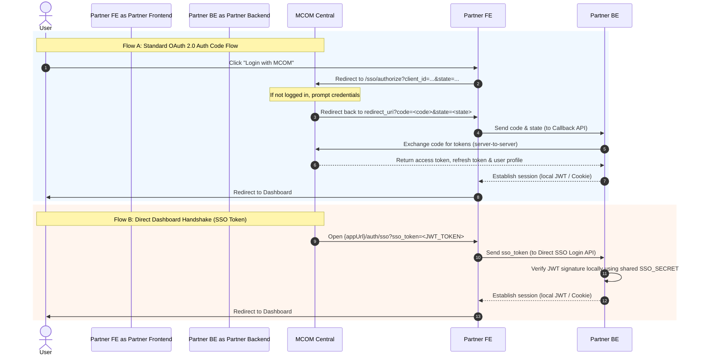

# MCOM Service Integration — Frontend SSO Guide

This guide describes how to implement the frontend integration inside any partner service (e.g., MCOM Mall, MCOM Loyalty, 247GBS) to handle Single Sign-On (SSO) authentication with MCOM Central.

---

## 0. Overview of Frontend SSO Responsibilities

The partner frontend works in tandem with the partner backend and MCOM Central. There are two primary authentication flows that the frontend must support:

1. **OAuth 2.0 Authorization Code Flow**: The standard flow where a user clicks "Sign In" on your app, is redirected to MCOM Central to authenticate, and is redirected back with an authorization code.
2. **Direct Dashboard Redirection (Shared JWT Handshake)**: When a logged-in user clicks on your app card from the MCOM Central Dashboard and is launched directly into your app with a short-lived token.

### SSO Flow Sequence



---

## 1. Required Frontend Environment Variables

Add these to your frontend's environment configuration file (e.g., `.env` or `.env.local`):

```bash
# 1. Base URL of MCOM Central Auth Endpoint (No trailing slash)
VITE_MCOM_CENTRAL_URL=https://auth.mcomsolutions.com
# (Use http://localhost:3010 in local development)

# 2. Your registered Client ID
VITE_SSO_CLIENT_ID=your-service-client-id # e.g., mcom-mall

# 3. Your frontend callback redirect URI (Must exactly match registered redirectUris)
VITE_SSO_REDIRECT_URI=http://localhost:3002/auth/sso

# 4. Your partner backend API URL
VITE_API_URL=http://localhost:3002/api
```

---

## 2. Implementing Flow A: Standard OAuth 2.0 Flow

### Step 1: Initiating Redirection to MCOM Central

When the user clicks the login button, your frontend must:
1. Generate a random string representing the `state` (to prevent CSRF attacks) and store it in `sessionStorage` or `localStorage`.
2. Construct the MCOM Central authorize URL.
3. Redirect the browser.

#### TypeScript Trigger Example

```typescript
import { v4 as uuidv4 } from 'uuid';

export function initiateMcomLogin() {
  const centralUrl = import.meta.env.VITE_MCOM_CENTRAL_URL;
  const clientId = import.meta.env.VITE_SSO_CLIENT_ID;
  const redirectUri = import.meta.env.VITE_SSO_REDIRECT_URI;
  
  // 1. Generate and persist CSRF state
  const state = uuidv4();
  sessionStorage.setItem('oauth_state', state);

  // 2. Optional: Save destination path if you want to redirect the user back there after login
  sessionStorage.setItem('post_login_redirect', window.location.pathname);

  // 3. Construct redirect URL
  const authUrl = new URL(`${centralUrl}/api/v1/auth/sso/authorize`);
  authUrl.searchParams.append('client_id', clientId);
  authUrl.searchParams.append('redirect_uri', redirectUri);
  authUrl.searchParams.append('response_type', 'code');
  authUrl.searchParams.append('state', state);
  authUrl.searchParams.append('scope', 'profile email');

  // 4. Redirect browser
  window.location.href = authUrl.toString();
}
```

### Step 2: Implementing the Callback Route (`/auth/sso` or `/auth/callback`)

The callback route is the page MCOM Central redirects the browser to after a successful login. It will contain `code` and `state` parameters in the URL:
`http://localhost:3002/auth/sso?code=XYZ123&state=STATE_VALUE`

Your Callback page component must:
1. Extract `code` and `state` from URL parameters.
2. Validate that the URL `state` matches the one stored in `sessionStorage`.
3. Send `code` and `state` to your backend callback endpoint to exchange it for local session tokens.
4. Clean up stored state and redirect to the dashboard.

#### React Component Example

```tsx
import React, { useEffect, useState } from 'react';
import { useNavigate, useSearchParams } from 'react-router-dom';
import axios from 'axios';

export default function SsoCallbackPage() {
  const navigate = useNavigate();
  const [searchParams] = useSearchParams();
  const [error, setError] = useState<string | null>(null);

  useEffect(() => {
    const code = searchParams.get('code');
    const state = searchParams.get('state');

    // 1. Extract values
    if (!code || !state) {
      setError('Invalid redirect callback parameters.');
      return;
    }

    // 2. Verify CSRF State
    const savedState = sessionStorage.getItem('oauth_state');
    if (!savedState || state !== savedState) {
      setError('CSRF State mismatch. Request could be forged.');
      return;
    }

    // Clean up state
    sessionStorage.removeItem('oauth_state');

    // 3. Call backend callback to exchange code and establish session
    axios.post(`${import.meta.env.VITE_API_URL}/auth/callback`, {
      code,
      state
    })
    .then((response) => {
      // 4. Establish local session
      // If backend returns a token, store it
      if (response.data.accessToken) {
        localStorage.setItem('auth_token', response.data.accessToken);
        localStorage.setItem('user', JSON.stringify(response.data.user));
      }

      // Check if we have a saved post-login redirect path
      const targetRedirect = sessionStorage.getItem('post_login_redirect') || '/dashboard';
      sessionStorage.removeItem('post_login_redirect');

      navigate(targetRedirect);
    })
    .catch((err) => {
      console.error('SSO Token Exchange failed:', err);
      setError(err.response?.data?.error || 'Authentication failed. Please try again.');
    });
  }, [searchParams, navigate]);

  if (error) {
    return (
      <div className="min-h-screen flex items-center justify-center bg-gray-50 p-6">
        <div className="max-w-md w-full bg-white rounded-3xl p-8 border border-red-100 shadow-xl text-center">
          <h2 className="text-2xl font-bold text-red-600 mb-4">SSO Authentication Error</h2>
          <p className="text-gray-600 mb-6">{error}</p>
          <button 
            onClick={() => navigate('/login')}
            className="w-full bg-blue-600 text-white py-3 rounded-2xl font-semibold hover:bg-blue-700 transition"
          >
            Back to Login
          </button>
        </div>
      </div>
    );
  }

  return (
    <div className="min-h-screen flex flex-col items-center justify-center bg-gray-50">
      <div className="animate-spin rounded-full h-12 w-12 border-b-2 border-blue-600 mb-4"></div>
      <p className="text-gray-500 font-medium">Completing MCOM sign in...</p>
    </div>
  );
}
```

---

## 3. Implementing Flow B: Direct Dashboard Redirections (Shared JWT Handshake)

When a user launches your platform from their MCOM Central Dashboard, MCOM Central signs a short-lived token and opens your app directly, attaching the token to the URL query string:
`http://localhost:3002/auth/sso?sso_token=<JWT_TOKEN>` (or `sso-login?token=<JWT_TOKEN>`)

Your frontend must intercept this token, post it to your backend's direct SSO verification route, and set up your session.

### React Component for Dashboard Launches

You can handle this in your main login page, or create a dedicated route like `/auth/sso` that handles **both** the authorization code and the direct SSO token.

```tsx
import React, { useEffect, useState } from 'react';
import { useNavigate, useSearchParams } from 'react-router-dom';
import axios from 'axios';

export default function SsoDirectPage() {
  const navigate = useNavigate();
  const [searchParams] = useSearchParams();
  const [error, setError] = useState<string | null>(null);

  useEffect(() => {
    // 1. Intercept sso_token or token query parameter
    const ssoToken = searchParams.get('sso_token') || searchParams.get('token');
    
    if (!ssoToken) {
      setError('No SSO login token found.');
      return;
    }

    // 2. Post token to backend to verify signature and set up session
    axios.post(`${import.meta.env.VITE_API_URL}/auth/sso-login`, {
      token: ssoToken
    })
    .then((response) => {
      // 3. Establish local session
      if (response.data.accessToken) {
        localStorage.setItem('auth_token', response.data.accessToken);
        localStorage.setItem('user', JSON.stringify(response.data.user));
      }

      // Redirect to the internal dashboard
      navigate('/dashboard');
    })
    .catch((err) => {
      console.error('Direct SSO verification failed:', err);
      setError(err.response?.data?.error || 'SSO authentication token invalid or expired.');
    });
  }, [searchParams, navigate]);

  if (error) {
    return (
      <div className="min-h-screen flex items-center justify-center bg-gray-50 p-6">
        <div className="max-w-md w-full bg-white rounded-3xl p-8 border border-red-100 shadow-xl text-center">
          <h2 className="text-2xl font-bold text-red-600 mb-4">Direct Login Error</h2>
          <p className="text-gray-600 mb-6">{error}</p>
          <button 
            onClick={() => navigate('/login')}
            className="w-full bg-blue-600 text-white py-3 rounded-2xl font-semibold hover:bg-blue-700 transition"
          >
            Back to Login
          </button>
        </div>
      </div>
    );
  }

  return (
    <div className="min-h-screen flex flex-col items-center justify-center bg-gray-50">
      <div className="animate-spin rounded-full h-12 w-12 border-b-2 border-blue-600 mb-4"></div>
      <p className="text-gray-500 font-medium">Validating dashboard session...</p>
    </div>
  );
}
```

---

## 4. Session Retention & Expiration Handlers

Once authenticated, your frontend should attach the authorization token to all outgoing API requests to your partner backend. If the token expires (typically resulting in a `401 Unauthorized` status code), you should catch the error and redirect to the sign-in flow.

### Axios Interceptor Example

```typescript
import axios from 'axios';

export const apiClient = axios.create({
  baseURL: import.meta.env.VITE_API_URL,
  headers: { 'Content-Type': 'application/json' },
});

// 1. Inject access token into request header
apiClient.interceptors.request.use(
  (config) => {
    const token = localStorage.getItem('auth_token');
    if (token && config.headers) {
      config.headers.Authorization = `Bearer ${token}`;
    }
    return config;
  },
  (error) => Promise.reject(error)
);

// 2. Catch 401 Unauthorized and prompt re-authentication
apiClient.interceptors.response.use(
  (response) => response,
  (error) => {
    if (error.response?.status === 401) {
      // Clear expired local session data
      localStorage.removeItem('auth_token');
      localStorage.removeItem('user');
      
      // Send user back to login page or directly trigger SSO redirect
      window.location.href = '/login?expired=true';
    }
    return Promise.reject(error);
  }
);
```

---

## 5. Single Log Out (SLO)

To implement logout on your frontend:
1. Clear the local storage and local cookies containing the user session.
2. Direct the browser to MCOM Central's logout endpoint to terminate the central session and redirect back to your login screen.

#### React Logout Function Example

```typescript
export function performLogout() {
  // 1. Clear local credentials
  localStorage.removeItem('auth_token');
  localStorage.removeItem('user');
  
  // 2. Redirect to MCOM Central SSO logout (so the user is signed out centrally)
  const centralUrl = import.meta.env.VITE_MCOM_CENTRAL_URL;
  const returnUrl = encodeURIComponent(window.location.origin + '/login');
  
  window.location.href = `${centralUrl}/api/v1/auth/sso/logout?redirect_uri=${returnUrl}`;
}
```
